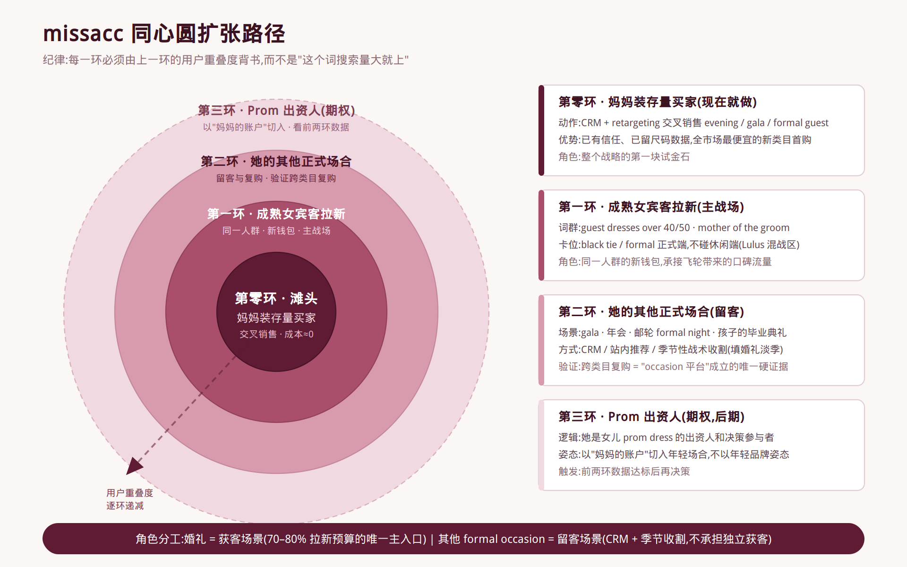
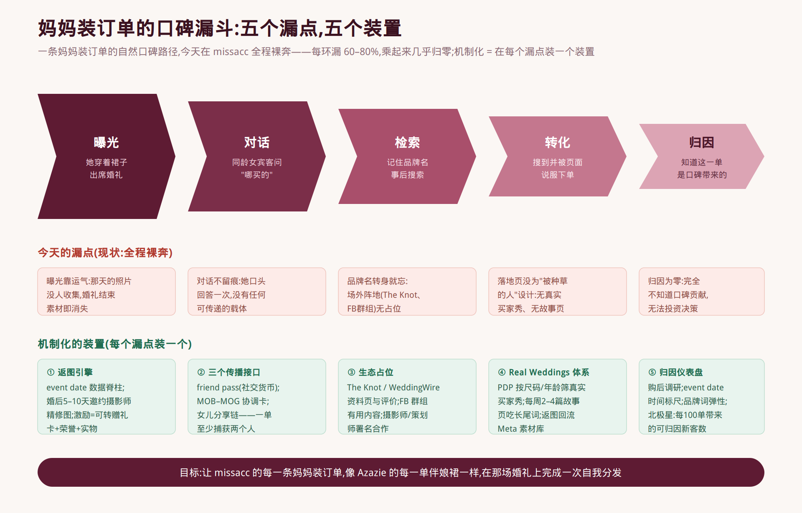
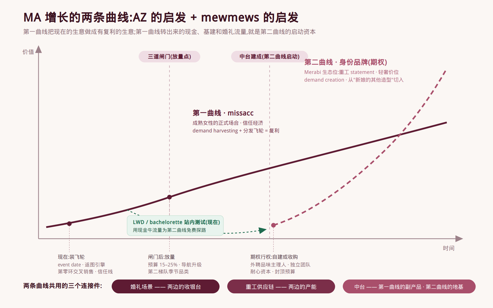

# MA 增长战略文档 · 补充章节

> 本文件是对《MA 的增长:人群、场景、品类》的补充,修复六个核心缺口。
> 每节开头标注了合并位置,可直接并入原文档。

---

## 合并对照表

| 补充 | 合并位置 | 修复的问题 |
|---|---|---|
| 补充 A:四象限矩阵 | 原文 2.1(内容缺失处) | 结构缺失 |
| 补充 B:两个市场对照表 | 原文 2.2.2.3(内容缺失处) | 结构缺失 |
| 补充 C:同心圆扩张路径 | 插入原文 2.2.1 之后 | 扩张顺序丢失 |
| 补充 D:中台的定义 | 插入原文第 1 节"核心结论"之后 | "中台"未定义 |
| 补充 E:验证、闸门与杀死条件 | 新增第 5 章 | 证伪条件缺失(最大缺口) |
| 补充 F:保护纪律 | 新增第 6 章 | "护什么"缺失 |
| 补充 G:行动时间表 | 新增第 7 章 | 时间分层混乱 |
| 补充 H:数据置信度标注 | 全文修订说明 | 数据可信度未分级 |
| 补充 I:配图两张 | 口碑漏斗图 → 原文 3.1.1;双曲线图 → 原文第 3 章开头 | 关键逻辑缺少视觉化 |
| 补充 J:流量套利 vs 品牌升级 | 插入原文 3.1 开头(编为 3.1.0,原小节顺延) | AZ 板块缺"为什么"的地基 |

---

## 补充 A(原文 2.1):occasion 需求四象限矩阵

用两根轴切分场合礼服需求,基本可以切出所有物种:

- **轴一:决策周期**——提前数月买,还是提前数天买。决定供应链形态:长周期养得起 made-to-order,短周期必须现货。
- **轴二:购买者在优化什么**——"不能出错"(得体、合身、符合 dress code),还是"要够惊艳"(时髦、性感、上镜)。决定素材、商品企划和退货结构:前者是信任生意,后者是趋势生意。

| | 优化"不能出错" | 优化"要够惊艳" |
|---|---|---|
| **长决策周期** | 妈妈装、伴娘、gala、formal wedding guest、evening——**主场,MA 资产全部命中** | prom、homecoming——供应链命中,心智一半命中,**次级战场(季节性收割)** |
| **短决策周期** | 临期 wedding guest、商务正式场合——需先建现货线,**第二阶段** | party、club、holiday sexy——**永久排除区,Babyboo / Mewmews / Fashion Nova 的地盘** |

**结论:missacc 的 occasion 是左上象限——长决策周期、"不能出错"型的正式场合。**

---

## 补充 B(原文 2.2.2.3):两个市场对照表

| | 市场 A:18–35 trend occasion | 市场 B:成熟女性正装 |
|---|---|---|
| 需求趋势 | 见顶回落,头部营收全线下滑 | 平稳增长(妈妈装 CAGR ≈4.6%),渠道从百货向线上迁移中 |
| 竞争烈度 | 四层玩家绞杀,Shein 锚死价格底板 | 三阵营各有致命伤,无人占据品牌心智 |
| 竞争武器 | 内容工业化 + 快反供应链 | 信任、fit、交期确定性、服务 |
| MA 资产契合 | 几乎为零 | custom size、正装供应链、妈妈装存量客群全部命中 |
| 利润结构 | 高退货、高营销费率、低忠诚 | 高客单、低退货、低趋势风险 |
| 主要风险 | 进场即消耗战 | 增速平缓;JJ's House 的 SEO 存量壁垒;Azazie 侧翼渗透 |

---

## 补充 C(插入原文 2.2.1 之后):同心圆扩张路径

> 图源文件为 `assets/同心圆扩张路径.svg`(矢量,可编辑文字后重新导出)。

扩张顺序的纪律来自 Azazie:**每一环都必须由上一环的用户重叠度背书**,而不是"这个词搜索量大就上"。

1. **第零环(现在就做,获客成本≈0)**:妈妈装存量买家 → evening / gala / formal guest 交叉销售。她已有信任、已留尺码数据,是全市场最便宜的新类目首购,也是整个战略的第一块试金石。
2. **第一环(主战场,拉新)**:成熟女宾客——"wedding guest dresses for women over 40/50"、"mother of the groom"、black tie guest 的正式端。同一人群,新钱包。
3. **第二环(留客与复购)**:她的其他正式场合——gala、年会、邮轮 formal night、孩子的毕业典礼。把"婚礼客户"变成"人生正式场合客户",跨类目复购在这一环验证。
4. **第三环(期权,后期)**:她是女儿 prom dress 的出资人和决策参与者——以"妈妈的账户"切入年轻场合,而不是以年轻品牌的姿态。做不做,看前两环数据。

**角色分工:婚礼是获客场景(承担 70–80% 拉新预算的唯一主入口),其他 formal occasion 是留客场景(CRM / 站内 / 季节性战术收割),不承担独立获客任务。** gala(Q4)、graduation(初夏)、holiday(Q4)的季节峰恰好填在婚礼淡季,产能和预算可削峰填谷。

---

## 补充 D(插入原文第 1 节之后):中台的定义与"刻意化"标准

### 中台是什么

一个品牌站由六层构成。多品牌是否可行,取决于新品牌的边际成本;边际成本取决于前五层有多少是共享的:

| 层 | 内容 | 属性 |
|---|---|---|
| 供应链 | 选品、打版、生产、备货、质检 | 可共享 |
| 履约 | 仓储、物流、退换货、客服 | 可共享 |
| 站点技术 | 建站、支付、风控、A/B 基建 | 可共享 |
| 数据 | 埋点、归因、看板、人群资产 | 可共享 |
| 投放体系 | 账户结构、feed 体系、素材流水线、测试方法论 | 大部分可共享 |
| 品牌层 | 定位、审美、内容调性、社群、商品企划 | **不可共享,也不该共享** |

MA 现状:六层全部焊死在 missacc 里。此时起新品牌 = 六层固定成本全部重付,失败全部沉没——所以是豪赌。中台建成后,新品牌只付第六层的成本——豪赌降级为封顶预算的实验。

### "刻意化"的操作定义

occasion 扩张反正要新建三样东西:**ready-to-ship 供应链、按品类拆分的投放体系、场合化的站点与数据基建**。每一样都有两种建法:建成 missacc 的专属器官,或建成公司能力。成本相差无几,后果天差地别。

**判断标准只有一句话:每建一样东西,问"如果明天起第二个品牌,这个东西能不能原样复用?"** 能,就照可复用的方式建(流程化、模板化、参数化);不能,就是在给 missacc 造专属器官。

### 两条警戒线

1. **中台不解决品牌成败,只解决失败的成本。** 品牌层(定位、审美、内容)才决定成败,且不可共享——共享了就是同一个品牌换皮。
2. **不要提前中台化。** 在第二个品牌还没影时大建中台,是从 n=1 做抽象,必然错(参考阿里中台收缩的教训)。正确节奏:occasion 扩张需要什么就建什么,只是按可复用的方式建;真正的抽象留给第二个品牌落地时,用真实的第二个用例逼出来。**中台是扩张的副产品,不是先修的庙。**

---

## 补充 E(新增第 5 章):验证、闸门与杀死条件

> 本章是整份战略的"宪法"。有了证伪条件,这个计划才是一个实验;否则它是一个信仰。

### 5.1 开关性验证(所有动作之前,本周执行,成本≈0)

**假设:evening 类目现有买家和妈妈装买家是同一类人。**

从后台拉三组数据:evening 买家的年龄结构、custom size 使用率 / 尺码分布、与妈妈装买家的客户重合度。

- **证实**(evening 买家偏 40+、fit 需求高):战略几乎自动成立,妈妈装→evening 的桥是现成的,按同心圆全速推进;
- **证伪**(evening 买家偏 25–35 年轻女性):战略主轴重新权衡——"成熟女性正装是竞争最弱的空地"这个判断依然成立(它来自竞争格局,不来自我们的数据),但入场的桥要重新设计:第零环交叉销售取消,改为直接在第一环(成熟宾客词群)用广告拉新验证,成本上升、周期拉长,预算相应收缩。

### 5.2 三道闸门(孵化期出门条件,三条全过才放量)

1. **occasion 新客占比**持续上升——证明是净拉新,不是老客换入口被重复计数;
2. **贡献毛利**(收入 − 折扣 − COGS − 运费 − 退货退换 − 支付费 − 广告费)为正,或呈明确收敛趋势;
3. **增量验证**确认净新增为主——至少用 geo holdout 或分市场对照,排除 occasion campaign 从 wedding 轨道抢归因造成的虚高。平台归因数字不作为放量依据。

放量后新增第四道持续监测:**跨类目复购**真实发生(买伴娘裙/妈妈装的人回来买 wedding guest / evening)。这一条是"occasion 平台"故事成立的唯一硬证据;不成立,说明我们只是把互不相关的人群放在同一个站里,做的是流量套利而不是品牌升级。

### 5.3 杀死条件(事先写死,防止事后合理化)

连续两个完整需求季,若同时出现:occasion 新客 CAC 高于 wedding 新客 CAC 两倍以上、且贡献毛利无收敛趋势、且跨类目复购率与随机水平无异——**判定"occasion 平台"假设不成立**:收缩回 evening/formal 作为 wedding 的附属类目,不再追加投入,保留信任线和飞轮资产(它们对 wedding 主业依然有效)。

未过闸门但未触发杀死条件时:回到 evening/formal 收窄打法,先排查 SKU、交期、尺码、素材等执行变量,**不直接升级为"战略错了"的结论**。

### 5.4 预算原则:按"封顶亏损"批,不按"目标 ROAS"批

孵化期的正确问法不是"occasion 的 ROAS 目标是多少",而是"我们愿意为验证这个方向支付的学费上限是多少"——一个封顶数字(媒体费 + 备货资金占用 + 人力),花完必须过闸门才续。参考配比:80–85% wedding core / 10–15% occasion 孵化 / 5% 实验,允许 occasion 新客 CAC 高于 wedding 20–40%。

---

## 补充 F(新增第 6 章):保护纪律——扩张不许伤到什么

> 团队听完战略的第一反应必然是"wedding 广告要不要动、退货要不要放开"。本章就是答案:**都不动。**

### 6.1 三轨制:现金牛完全保护

- **轨道一 Wedding Core(妈妈装、婚纱、伴娘裙及配套)**:预算、账户结构、落地页、主力素材、campaign 全部保持稳定。三年模型是资产不是限制。明确禁止:首页 hero 大换血;把 wedding PMax 商品结构改成 all products;主力账户素材从 wedding 换成 occasion;为拓人群把 purchase 优化改成浅层事件;把 wedding/evening/party 全塞进一个 campaign 让系统自己猜。
- **轨道二 Occasion Expansion**:独立 campaign、独立商品集(product set / listing group)、独立落地页、独立素材、独立看板。不是独立品牌,但按独立业务线运营。
- **轨道三 Bridge Retargeting**:按浏览/购买品类拆分的跨场景迁移(买伴娘→推 guest;买妈妈装→推 evening/gala),吃交叉人群,把 wedding 信任资产转化为 occasion 认知。

**红线:妈妈装、婚纱、伴娘裙三大类目的 ROAS 和转化率,任何一项持续恶化,立即冻结扩张动作排查溢出。**

### 6.2 信任分层:8000 SKU 货架与信任线分账

全站放开无理由免费退 = 财务模型由盈转亏,**不做**。正确结构:

- **货架层(约 7500+ SKU)**:维持现行退货政策,继续作为现金引擎,一个字不改。
- **信任线(200–500 个精选款)**:从妈妈装 + evening 头部款中选出(订单量足、版型数据成熟、退货率低于均值),命名成可识别的产品线(如 "Missacc Signature"),打徽章。**全部信任承诺只对这条线生效。**

**顺序纪律:方差先行,政策后行。** 先在信任线上做方差工程(金样对照片验收、色卡从大货批次剪、版型基块统一、custom size 量体引导+确认),失败率降下来之后再放开政策——政策慷慨度跟着质量置信度走,不跟着口号走。

**信任工具梯子(从便宜的用起,免费退货是最贵的最后一级):**
1. 发货前实拍(成本≈0,她那条裙子过 QC 时拍照发她,大概率降低退货);
2. 改衣补贴(封顶 $30–50,一张改衣券救回一单退货);
3. 换货优先(换码换款免费,退款收费);
4. custom size 免费重做(只对定制单、真实不合身);
5. Event Guarantee(婚礼前 X 天出问题,加急重做或全退);
6. 无理由免费退(只给信任线,且前五级上齐、失败率达标之后)。

**验收方式:圈定实验。** 只在信任线上开完整信任栈跑两个季度,算**全环路贡献毛利**:(CVR 提升 × 客单)+(12 个月复购/推荐)−(退货与重做成本)。事先写死杀死条件:方差工程做完后全环路仍为负 → 信任战略降级为"高效货架 + 有限信任工具(实拍/改衣补贴/Event Guarantee)"。

### 6.3 前提条件:ready-to-ship 子线是关键路径

occasion 里 deadline 驱动的部分(临期 guest、homecoming、holiday)必须有现货子线支撑。这是供应链和现金流的新肌肉:销量预测、首单备货量、补货触发、滞销清理、退货翻新回库——**按"能力"建,不按"missacc 功能"建(中台刻意化标准)。现货线未就位前,第二梯队季节性品类不开打。**

### 6.4 组织:没有 owner,一切纪律名存实亡

occasion 扩张 / 信任线 / 分发飞轮需要一个**对贡献毛利单独负责的 owner** 和小型专职 pod(owner + 投放、商品、素材专人),考核指标是闸门指标,不是大盘 GMV。如果 occasion 是各团队的兼职任务,它在每一次资源冲突里都会输给 wedding core。**组织上不独立,轨道上独立就是假的。**

---

## 补充 G(新增第 7 章):行动时间表——三层时间轴

> 原则:时间轴锚定场合日历(prom 1–4 月、婚礼旺季春夏秋、homecoming 8–9 月、gala/holiday 11–12 月),每个品类的信号建设期必须在需求季前完成,需求季只用来收割和学习。

### 第一层:现在就做(90 天内,不等任何闸门)

| # | 动作 | 说明 | 成本 |
|---|---|---|---|
| 1 | 拉 evening 买家数据 | 5.1 开关性验证,本周 | ≈0 |
| 2 | 结账采集 event date + 角色 | 飞轮数据脊柱,第一优先级 | 极低 |
| 3 | 婚礼日自动化时间轴 | 婚前建议 / 当天祝福 / 婚后 5–10 天返图邀请 | 低(CRM) |
| 4 | 返图引擎 v1 | 激励(可转赠礼卡+荣誉+实物小礼)+ 授权模板 + PDP 挂图 | 低 |
| 5 | 信任线圈定 | 选 200–500 款,金样制度、色卡改批次剪,上前三级信任工具 | 中 |
| 6 | 三轨制账户改造 | feed custom labels、product sets 拆分、occasion 独立 campaign 骨架 | 低 |
| 7 | 第零环交叉销售 | 妈妈装存量 → evening/gala/guest 的 CRM + retargeting | 低 |
| 8 | LWD / bachelorette 品类测试 | 30–80 款站内 collection,锁死在 Bride 语境,季前上线 | 中 |
| 9 | 看板与归因 | 按品类的新客 CAC / 首购品类 / 贡献毛利 / 复购看板 + 购后调研 | 低 |

### 第二层:闸门后做(过 5.2 三道闸门才启动)

- occasion 预算从 10–15% 提到 15–25%;
- 首页 occasion 权重 30%→40%,导航把 Special Occasion 提至与 Wedding 同级;
- 开打第二梯队季节性品类(prom/homecoming/gala,依赖现货线就位);
- SEO hub 页面矩阵铺开;
- 生态占位加码(The Knot 资料页与评价体系、FB 群组内容、摄影师/策划师合作计划);
- 中台抽象化:把扩张中沉淀的投放模板、落地页体系、数据看板文档化、参数化。

### 第三层:期权层(中台建成 + 闸门过完后再决策)

- **第二品牌(Merabi 生态位)**:身份表达型、重工 statement、轻奢价位;入场方式是"买肌肉"——外聘创意主理人 + 独立团队 + demand creation 的耐心资本模型(封顶预算 + 事先写死的杀死条件),或直接收购已跑出 PMF 的种子(收购是时间机器);滩头从"新娘的其他造型"切入(LWD 测试攒下的供应链手感、新娘数据、素材基准即启动资产)。
- **亚文化品类(42lolita 方向)**:先回答能力问题——组织里有没有真懂这个圈子的人;没有,不是战略选项。
- **prom 出资人环(第三环)**:视前两环数据决定。

---

## 补充 J(插入原文 3.1 开头,编为 3.1.0):流量套利 vs 品牌升级——先回答"为什么"

> 本节回答一个必然出现的质疑:"套利赚得好好的,为什么要做这些不直接出单的东西?"
> 后面 3.1.1–3.1.7 的所有装置,都建立在本节的结论上。

### 定义

- **流量套利**:赚"流量价格与转化价值之间的差价"。在竞价市场买进流量、卖出商品,吃价差。missacc 今天的主引擎就是它。
- **品牌**:赚"心智记忆产生的免费需求"。一部分人在需求产生时直接想起你、指名搜你、向别人推荐你——这部分需求不付流量税,或付税效率远高于对手。

一句话分界:**套利的每一单都要重新买,品牌的每一单会自己带来下一单。**

### 五个维度的差别

| 维度 | 流量套利 | 品牌 |
|---|---|---|
| 利润来源 | 竞价市场的定价错误(价差) | 记忆资产的租金(指名需求) |
| 时间效应 | **必然衰减**:价差被对手出价抹平、CPC 通胀、平台加税、AI 搜索拆除搜索货架 | **持续累积**:评价、复购、口碑、品牌词逐年变厚 |
| 财务位置 | 只产生利润表(当月买量当月出单) | 同时产生资产负债表(口碑、素材库、心智位置),决定企业估值 |
| 防御性 | 无——算得出的价差,资金更厚的对手也算得出 | 高——口碑分、真实素材库、"默认答案"位置抄不动 |
| 终局展品 | JJ's House:十五年、4.0 分、每单仍向 Google 交过路费,被晚四年的 Azazie 全面超越 | Azazie:品类默认答案,流量越来越多来自品牌词和口口相传 |

### 一个最简单的检验

**明天停掉所有广告,还剩下什么?** 纯套利公司的答案是零;品牌公司的答案是品牌词流量 + 复购 + 口碑推荐。这三项占营收的比重,就是"品牌含量"的刻度,也是本战略的长期仪表。

### 为什么 MA 必须升级:三条理由

1. **原材料已在手,不用等于闲置。** 大多数套利公司转型难在缺原料;MA 三样全有——4.4 分口碑(高于 Azazie 3.8 / JJ's 4.0)、妈妈装的人群锚点、婚礼这个自带围观与对话的自分发场景。纯套利模式下,这些资产一分钱租金都收不到;飞轮机制的本质就是开始向自己的闲置资产收租。
2. **品牌升级是 occasion 扩张成立的前提,不是锦上添花。** 三道闸门里的跨类目复购已经写死了分界:买妈妈装的人不回来买 evening/guest,就说明我们只是把互不相关的人群放在同一个站里——那是套利,而套利撑不起扩张(每个新类目都得按全价重新买流量,扩张变成在更多战场上做更薄的套利)。
3. **价差在收窄,无主心智还开着。** 竞价市场越有效套利越薄,这不可逆;AI 搜索正在让"货架"被跳过、"默认答案"被推荐。而"成熟女性的正式场合"这个心智位置至今无人认领。同样一块钱,买越来越贵的流量,或插一面没人抢的旗——边际回报的天平已经摆好。

### 纪律边界(防止误读)

**品牌升级不是否定套利、更不是砍投放。** 8000 SKU 货架和 wedding 广告模型是现金牛,照常全速运转(90/10 杠铃:90% 照常收割,10% 建复利资产)。飞轮的每一样装置——event date 字段、返图引擎、信任线、Real Weddings——都长在套利订单的既有路径上,几乎不增加获客成本。**做的不是二选一,是给收割机加装一台复利引擎:每一个买来的订单,顺手往资产负债表里存一笔。**

---

## 补充 I(配图):口碑漏斗与两条增长曲线

### 图 1 · 口碑漏斗五环(合并位置:原文 3.1.1,"自然口碑路径"文字段之后)

讲解用法:先讲上排漏斗(路径本身),再讲中排红色卡片(今天每环都在漏),最后讲下排绿色卡片(五个装置一一对应堵漏)。一张图讲完整个 3.1 节的逻辑。

### 图 2 · 两条增长曲线(合并位置:原文第 3 章开头,总纲段之后)

讲解用法:先指第一曲线的三个节点(现在装飞轮 → 闸门 → 放量),再指 LWD 测试的绿色虚线(现在就在为第二曲线探路),最后指第二曲线的启动点(中台建成后才行权)和底部三个连接件。这张图同时回答"先做什么、后做什么、为什么不冲突"。

> 三张配图源文件均为 SVG(`docs/assets/`),文字可编辑后用 cairosvg 重新导出 PNG。

---

## 补充 H(全文修订):数据置信度标注

### 分级标准

- **【A 级 · 一手/财报】**:上市公司财报、公司官方披露。可直接引用。
- **【B 级 · 第三方估计】**:行业报告、流量估算工具(Grips、ecommerceDB、prospeo 等)。仅作量级参考,不进财务模型。

### 需要在原文中修订的表述

| 原文表述 | 修订 | 级别 |
|---|---|---|
| Lulus 2025 营收 2.823 亿、-11%、EBITDA -120 万 | 保留 | A(财报) |
| Oh Polly 营收 6810 万英镑、税前利润 1055 万 | 保留 | A(年报) |
| Hello Molly ≈1.69 亿、下滑 20%+ | 标注"第三方估计" | B |
| 妈妈装全球 70 亿美元、CAGR 4.6% | 标注"第三方行业报告,量级参考,不进财务模型" | B |
| plus-size 市场 3060 亿→5330 亿 | 同上 | B |
| **"97.7% 素材是标准身材"** | **改为"时装秀场造型中 97.7% 为标准身材(Vogue Business 秀场统计)"——原始数据是秀场统计,不是广告素材统计,推论(45+ 素材是无人区)不变但表述必须准确** | B |
| 68% 美国女性穿 14 码+ | 标注"行业常引数据" | B |
| Azazie 2025 营收 3.106 亿 | 标注"第三方估计(Grips)" | B |
| mewmews 年收入约 8.5 万美元 | 标注"第三方粗估,仅说明其为早期玩家,数字本身不可靠" | B |
| **K 因子目标 8–12** | **改为"待基线测量后校准的假设值,非测算目标"——先测自然基线,再定目标** | 假设 |
| 返图率目标 10–15% | 同上,标注为初始假设 | 假设 |
| 预算配比 80/15/5、CAC 容忍 +20–40% | 标注"起点启发式,非经论证的阈值,按季度校准" | 假设 |

### 讲解时的免责句(建议原样使用)

> "市场规模类数字全部来自第三方报告,只用于判断量级和方向,不进任何财务模型;所有内部目标值(K 因子、返图率、预算配比)是待校准的假设,第一个季度的任务就是把它们换成实测值。欢迎挑战任何数字——量级不影响结论,结论的开关在我们自己后台的那次数据验证上。"
