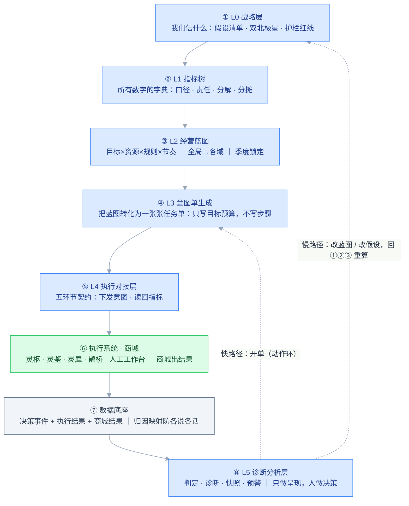

# 灵策系统总纲

> **灵策 = missacc 的经营决策中枢**：定方向、下蓝图、看诊断、做决策，形成闭环。
> 本文档是整个体系的唯一全局依据：讲清每一层是干什么的、里面有什么、上下游怎么接。所有跨模块的规矩（命名、口径、格式、权限）只登记在这里，各域需求文档只写自己域的内容、引用本文档。
> 读者假设：没见过这个框架。按顺序读完第 1–3 节，就能看懂整个体系。

---

# 1. 这个系统是什么

一句话：**灵策是公司经营的大脑——它不直接执行业务动作，它决定做什么、投入多少，并持续检验执行效果。**

- 执行由专门的执行系统承担：灵枢（修图换图）、灵犀（素材生成+投放）、鹊桥（客服）等；尚无系统对接的环节暂由人工执行。
- 灵策做四件事：**定方向**（我们相信什么、要达成什么）、**下蓝图**（目标怎么分解、资源怎么分配）、**看诊断**（执行效果如何、哪里偏离）、**做决策**（接下来做什么）。
- 核心原则：**系统出证据，人拍板**。灵策不替人做决定，它把"哪里异常、证据是什么、可以去哪处理"完整呈现给决策者。

## 1.1 一圈八步

整个系统就是一个循环，按 ①→⑧ 顺时针走一圈，⑧ 之后回到 ①②③ 进入下一圈：



八步逐项说明（每步一句话）：

| 步 | 名字 | 干什么 |
|---|---|---|
| ① | L0 战略层 | 把"我们相信什么"登记为可被数据检验的战略假设，把"什么不能触碰"登记为护栏红线 |
| ② | L1 指标树 | 为全公司每个指标建立唯一登记：口径怎么算、谁负责、怎么分解、怎么分摊——只定义一次，全系统引用 |
| ③ | L2 经营蓝图 | 把目标、资源、分配规则、时间节奏四项一起确定并锁定：全局定盘子，各域接切片 |
| ④ | L3 意图单 | 把蓝图转化为一张张任务单——对象、目标、预算、时限，人确认后下发 |
| ⑤ | L4 执行对接层 | 五个环节各有一份契约：下发什么类型的意图单、读回什么指标 |
| ⑥ | 执行系统·商城 | 执行系统（或人工）按单执行，商城产出结果数据 |
| ⑦ | 数据底座 | 三类数据（决策事件/执行结果/商城结果）全部落库，每条带意图单编号——事后可对账 |
| ⑧ | L5 诊断分析层 | 产出判定、诊断、快照、预警四类判断依据，呈现给决策者；开单走快路径，改蓝图走慢路径 |

**决策回流两条路**，判据一条：**这次调整要不要改蓝图上已写下的数字或方向？**

- 不需要改 → **快路径**：直接生成一张意图单（如批准一次换图、确认一次下架），走动作环，在一周到 90 天内完成闭环；
- 需要改 → **慢路径**：回 L2 修订蓝图（变更留痕），差距过大时先回 L0 检验假设是否仍然成立，修订后重新生成意图单。

# 2. 三条轴：怎么定位任何一个东西

系统里任何一个页面、指标、决策，都能用三个坐标说清楚它在哪：

- **流程轴（L0–L5）**：它处在决策流程的哪一步——定方向、定数字、下蓝图、开单、执行、对账。
- **对象轴（经营对象树）**：它作用在谁身上——**总盘 → 站点 → 大类 → 品类 → SPU → SKU**。最细一层是"站点×SKU"的在线 listing。
- **职能轴（五个经营域）**：它归哪个域管——**商品 / 运营 / 营销 / 供应链 / 客服**，与 L4 五环节一一对应。

举例：品类驾驶舱 = L5（流程轴）× 品类（对象轴）× 商品域（职能轴）。

## 2.1 对象轴补充说明

```
总盘 → 站点 → 大类 → 品类 → SPU → SKU
        │       │       └ 品类梯度：第一重点/第二重点/常规/小品类（假设驱动 · 年度人定 · 大类内划分）
        │       └ 大类：衣服 / 鞋子+ACC（静态归类）
        └ 站点分级：S 级站点配专属运营/营销（单独规则、单独产能账）
横向对象（不在树上）：风格库 · 渠道（营销域）· 供应商（供应链域）· 服务线（客服域）
```

两条硬规矩：**分站之和 = 全站**（带站点维度的指标，分站加总必须等于全站，口径设计时就要保证）；**横向对象的成本和结果必须能摊到"站点×品类"**才能汇总（分摊口径预留在 L1）。

## 2.2 职能轴：五个域

| 域 | 主经营对象 | 规划载体（L2） | 反馈载体（L5） | 执行系统 | 状态 |
|---|---|---|---|---|---|
| 商品（含价格·上下架） | 品类（→SPU→SKU） | 品类规划表 + 产能账 | 品类驾驶舱 + 款级分析 | 灵鉴→灵枢；价格执行方待定 | **需求完成（参照样板）** |
| 运营 | 活动 + 自有触点（EDM / App） | 活动规划 + 触点计划 | 活动复盘 + 触点效率 | 执行方待定 → 人工工作台 | 待启动（下一步） |
| 营销 | 渠道 × 站点 | 预算分配表 | 营销驾驶舱（效率/漏斗） | 直连灵犀 | 占位（占位域中优先） |
| 供应链 | 供应商 × 产能（+面辅料与少量有库存类目） | 备货计划 + 产能供应商计划 | 供应链驾驶舱 | 暂无系统 → 人工工作台 | 占位（产能账已有雏形） |
| 客服 | 服务线 × 站点 | 服务标准登记（红线/SLA/政策） | 服务驾驶舱 | 鹊桥 | 占位 |

域边界备忘：**营销 = 付费获客**（花媒体钱买流量），**运营 = 自有流量经营**（站内活动、EDM、App，不花媒体钱）。运营域是"横向打包"域——活动要引用其他域的动作组包。

## 2.3 全局一份 vs 各域各写

分界线：**框架、格式、总账全局一份；条目、阈值、内容各域认领各写。** 每个域要交六张作业（见第 9 节"域接入清单"），商品域已全部交完，是其他域的参照样板。

# 3. 六层详解

每层按同一个格式讲：干什么 / 里面有什么 / 上游给它什么 / 它给下游什么。

## 3.1 L0 战略层——我们相信什么

**干什么**：把管理层的战略判断登记为"写下来、绑定指标、到期检验"的正式对象。判断失效时能被数据及时识别并触发规划回调，而不是沿着错误判断运行一整年。

**里面有什么**：

- **战略假设清单**：每条假设 = 可证伪的陈述 + 绑定验证指标 + 检验周期（默认季度）+ 状态（成立/存疑/证伪）+ 影响范围（证伪时知道回调哪条规划）。四类典型来源：市场容量判断、结构判断（美国 55/45）、策略判断（价格带/风格/新站点）、节点押注（旺季占比提到多少）。
- **双北极星**：GMV 与利润并列、同等重要；营销占比是两者的裁决器（超上限的 GMV 增长不算健康增长）。
- **护栏红线登记表**：全系统唯一出处。每条红线一行：指标、红线值、第一响应环节 Owner、升级路径、双触发参数（水平触线即日级升级 + 未触线但同比/环比连续恶化即预警）。每环节 0–2 条，宁缺毋滥。营销占比上限也收编在此。

**上游**：没有上游，这是起点（输入是人的判断 + 市场调研）。
**下游**：假设支撑年度规划的每个关键数字（L2 锁定时强制溯源）；红线被 L5 诊断和判定引擎全局引用；季度战略环回来检验假设。

## 3.2 L1 指标树——全系统指标的唯一登记处

**干什么**：保证全公司提到"转化率"时指的是同一个口径、每个指标有明确责任人、出现差距时有登记好的归因路径、一笔结果有明确的分摊规则。**树只存元数据不存数值**——数值存放在蓝图（目标端）和快照（现状端）。

**里面有什么（树管四样）**：

1. **口径字典**（身份证）：每个指标全系统唯一定义，含**可加性**属性——绝对值指标必须满足分站 Σ=全站；比率指标登记分子分母，分站/全站都从分子分母现算。
2. **责任登记**（户口本）：每个认领指标四件套——口径 / 基线 / 目标值指针 / Owner。双轴认领：环节轴（哪个域认）× 对象轴（挂树上哪一级）。可控性原则约束挂载层级：**利润最低挂到站点**（S 级站点有专属运营与营销，能对利润负责；品类层只看毛利），不下放品类。
3. **分解关系**（族谱）：指标的父子与归因路径——GMV 差距 → 流量×转化×客单 → 站点×大类×品类 → 驾驶舱定位。L5 的下钻导航走的就是这里登记的路。
4. **归因与分摊口径**（分账规则，预留为主）：多动作叠加在同一对象时效果怎么分摊、横向对象（渠道花费最急）怎么摊到站点×品类、利润怎么摊到站点。原则：**口径先登记对，启用可以后到**。

**四类指标**：北极星（定方向）/ 驱动（拆现在：流量×转化×客单、毛利率、营销占比）/ 先行（看未来：新品成功率、素材完备度等，每域 1–3 个）/ 护栏红线（守底线：只设红线值不设改善目标）。

**上游**：L0 定哪些指标是北极星和红线。
**下游**：所有层引用口径；L2 蓝图的目标值挂在认领指标上；底座归因映射按 L1 口径分摊；L5 下钻按分解关系走。

## 3.3 L2 经营蓝图——目标 × 资源 × 规则 × 节奏

**干什么**：把"要什么、投多少、怎么分、何时动"四项确定下来并**一起锁定**。目标和资源必须一起锁——仅锁目标不锁资源，未达成时无法区分"执行不力"与"资源不足"。

**里面有什么（四合一，全局→各域）**：

| 内容 | 全局层 | 域层（以商品域为例） |
|---|---|---|
| 目标（要什么结果） | 年度规划三篇：目标篇（GMV/利润/花费/占比 × 12 月）、结构篇（站点/大类/品类贡献占比）、策略篇（品类梯度）；年会锁定 | 品类规划表：站点×品类的 GMV/销量目标、盘子规划、上新方向（五板块） |
| 资源（投入多少） | 总产能、总预算 | 产能账（常规池/专项池/三级账）、营销预算、上新配额 |
| 规则（资源怎么分）——即"各域规则" | 梯度策略包 | 常规池"站点×等级"规则、专项池优先级、渠道分配规则 |
| 节奏（什么时候动） | 节点日历（全公司一本，见第 7 节） | 节点叠加包：旺季期间目标 + 动作包 + 资源预留，独立版本独立复盘 |

**锁定机制**：季度规划会锁定版本（快照、不回溯）；锁定时三道自动检查——**加总校验**（月Σ季Σ年、品类Σ大类Σ站点Σ总盘，不平不能锁）、**假设溯源**（激进目标/梯度调整/结构变化必须挂假设编号，挂不上当场补登记）、**变更留痕**（年中改目标 = 战略环级事件，必须关联假设状态变更）。

**上游**：L0 的假设支撑蓝图数字；L1 提供指标口径与目标挂载点。
**下游**：L3 开单的每个字段都从蓝图取数——目标取自规划表、预算取自产能账/预算池、时限取自节点日历、动作内容参考预案库。**蓝图未锁定不生成单子。**

## 3.4 L3 意图单——灵策向执行侧下达任务的唯一格式

**干什么**：把蓝图转化为一张张意图单。意图单只写"**对象、目标、预算、时限**"（给谁、要什么结果、给多少资源、什么时候要），不写实现步骤——实现方式由执行系统（或执行人）决定。

**两类来源**：

1. **周期性/节点性（批量）**：三件套相乘——规划表的策略目标 × 节点实例的触发时点 × 预案模板的动作清单 → 生成一批意图单草稿，人确认后下发。例：婚礼季 T−8 周自动生成"连衣裙品类 · 素材翻新 · 50 款 · XX 任务点 · 3 周内完成"。
2. **事件性（单张）**：由人在查看诊断后从决策区发起——批准一条换图候选即生成一张换图单，批准一条处置建议即生成一张下架单。

**核心字段**：编号（归因外键，贯穿到商城结果）、来源（蓝图/节点/诊断结论 ID/人工）、对象（站点×品类×SPU，站点默认全站）、目标（引用 L1 口径的指标+目标值）、预算（钱/任务点/配额，**必填预算来源=哪个池**）、时限、下发环节与路由、状态机（草稿→确认→下发→执行中→完成→**已判定**）、关联（规划行/叠加包/预案/假设编号，事件性单子此项可空）。

**事件性意图单的挂钩机制（四个必填关联，防止单据游离于体系之外）**：来源字段关联诊断结论（为什么发起）、目标字段关联 L1 指标（验收标准）、预算来源关联资源池（**规划的控制力由此实现**——单张意图单不修改蓝图，但额度从蓝图分配的资源池中扣减；此类单据过多会在月度产能对账中显形，推动蓝图层重新决策）、编号关联归因（判定引擎按编号回填效果）。

**信封统一、信各域定义**：格式全局一套；各域定义自己的意图单类型（商品：换图单/处置单/素材单/价格单；运营：活动单/EDM 波次单/push 单；营销：预算分配单；供应链：备货计划单；客服：专项治理单）。

**上游**：L2 提供全部取数；L5 诊断提供事件性触发。
**下游**：经 L4 契约下发到执行终点；编号成为底座归因的主键。

## 3.5 L4 执行对接层——五环节契约

**干什么**：规定每个环节"下发什么类型的意图单、读回什么指标"。它是灵策与执行系统之间的接口约定。

**关键机制：执行方待定不阻塞**——没有系统对接的环节，意图单终点落到**人工工作台**（个人待办中心），人执行完手工回填结果（带意图单编号），归因链不断。接入一个执行系统 = 把人工终点替换成系统终点，契约不用改。

| 环节 | 下发（意图单类型） | 读回 | 执行终点 |
|---|---|---|---|
| 商品（含价格·上下架） | 换图单、处置单、素材单、价格单 | 素材覆盖、判定五态、CTR、处置执行结果 | 换图/素材经灵鉴→灵枢；价格·上下架→人工工作台（执行方待定） |
| 运营 | 活动目标包单、EDM 波次单、App push 单 | 活动达成、触点效率（打开/点击/退订/活跃） | 人工工作台（执行方待定） |
| 营销 | 预算分配单（站点×渠道×期间） | 渠道效率（ROAS/CPC）、花费、漏斗 | 直连灵犀 |
| 供应链 | 备货计划单（面辅料＋少量有库存类目） | 到货、库存水位、交付周期 | 人工工作台（暂无系统，预留） |
| 客服 | 专项治理单（如某品类客诉恶化的治理任务） | 违规、客诉、争议、首次解决率 | 鹊桥 |

**注意**：红线值、SLA 这类**标准**的更新不开意图单——标准走配置中心版本同步（改一处全局生效）；意图单只装"有目标有时限的一次性任务"。

**上游**：L3 的单子。
**下游**：执行系统/人工工作台；回传结果进底座。

## 3.6 L5 诊断分析层——产出判断依据，不产出决策

**干什么**：回答"做得怎么样、哪里不对"。**只做呈现，人做决策**。产出四类判断依据：

1. **效果判定结论**（按单）：判定引擎按意图单编号回填五态（起效/无效/恶化…）——动作环的输入；有效的沉淀入风格库，无效的触发止损。
2. **诊断结论**（按格子，定期）：显式输出，无异常也要说"本期 N 项全部正常"；非正常结论必带触发规则 + 证据 + 决策出口。
3. **月度快照**（对账底板）：现状+目标+差距+结论整体归档，不可改。"差距成立"只认快照不认日刷数据（单日波动不构成规划信号）。
4. **预警**（主动送达）：仅两类日级信号——护栏红线触发、节点触发链延误，直推待办中心置顶红条。

**诊断矩阵（覆盖地图）**：对象轴五行 × 职能轴五列，每格三件事——**策略与规则 / 诊断内容 / 决策出口**。格子不等于页面：总盘一行 = 总盘驾驶舱一页；品类行×商品域 = 品类驾驶舱八面板；SPU 行×商品域 = 款级分析（等级迁移、集中度清单、效果判定）。

| 对象轴 ↓ \ 职能轴 → | 商品（含价格） | 运营 | 营销 | 供应链 | 客服 |
|---|---|---|---|---|---|
| 总盘 | ←―――――― 总盘驾驶舱·四面板（各域汇总而上、诊断出口下钻而下）――――――→ | | | | |
| 站点 | 站点产能账（S 级单列） | S 级专属运营 | S 级专属营销 | 待补 | 待补 |
| 大类·品类 | 品类驾驶舱·八面板（含梯度） | 活动-EDM-App 诊断（待补） | 品类营销（待补） | 待补 | 品类售后（待补） |
| SPU·SKU | 等级迁移·集中度款级清单、上下架建议·素材覆盖、价格诊断（待补）、效果判定（五态·按归因） | 待补 | 待补 | 待补 | 待补 |
| 横向对象 | 风格库计分卡 | 待补 | 渠道 | 供应商 | 服务线 |

三条矩阵规矩：

- **待补格子跟域启动走**，不单独立项——域没启动时，格子以**摘要行**形式寄居在品类驾驶舱面板里（面板七营销效率 = 营销格的摘要，面板八服务交付 = 客服格的摘要）；域启动后摘要行变跳转、格子独立。例外：价格诊断跟商品域下轮迭代补。
- **站点范围**：全站（现在）→ 分站（明年，S 级先独立）。数据侧已带站点字段，预留的只是规则侧：每条诊断规则带"生效范围"参数，**分站规则默认继承全站、可覆盖**（复用配置中心作用域机制）。
- **总盘诊断出口（双北极星各有各的路）**：GMV 落后 → 对象树下钻（定位"谁"）+ 漏斗因子分解（定位"什么"）；利润落后 → 因子分解（毛利率×结构+费用），将来可下钻到站点层即止；结构偏离 → 战略环议题；红线触发 → 升级机制；先行恶化 → 对应环节 Owner。

**上游**：底座的三类数据 + L2 送入的目标基线（只读投影）。
**下游**：人。快路径回 L3 开单，慢路径回 L0/L1/L2 重算。三会材料（周/月/季）= 判定+诊断+快照按会议节奏装配，**后置**。

# 4. 执行系统与商城

| 系统 | 管什么 | 接什么 |
|---|---|---|
| 灵枢 | 修图、换图执行（含买家秀生产链路） | 商品域意图单，经灵鉴路由 |
| 灵鉴 | 纯路由，**只服务灵枢** | 不做决策，只分发 |
| 灵犀 | 素材生成 + 投放 | 营销域意图单，直连（不经灵鉴） |
| 鹊桥 | 客服系统 | 客服域意图单 |
| 人工工作台 | 执行方待定环节的兜底终点 | 价格·上下架、运营（活动/EDM/App）、供应链 |
| 商城 | 平台结果数据源（流量/加购/订单/GMV） | 不接意图单；结果数据写入底座 |

素材切分线：**挂在 SPU 上的商品素材**（主图/详情页/买家秀）归灵枢；**挂在渠道/campaign 上的投放素材**归灵犀。

# 5. 数据底座（概要）

三类记录全部落库：**决策事件**（意图单下发、审批、配置变更——灵策自己写，动作带时间戳）、**执行结果**（执行系统或人工回填，必带意图单编号）、**商城结果**（键=站点+SKU+时间，天然不带编号）。

**归因映射**（防各说各话）：决策→执行是强链接（编号直传）；执行→商城是弱链接（按"对象+时间窗"锚定——换图判定引擎的事件锚定推广为全系统规矩）。多动作叠加 v1 原则：**不强制分摊、强制记账**——商城结果关联"同期生效动作集"（窗口内所有意图单编号完整记录），单动作判定时显式标注干扰项，比例分摊口径预留在 L1。

详见《数据底座与归因映射》。

# 6. 全域共用件

- **节点日历（全公司一本）**：三类节点（周期型=同期曲线回算、日历型=人工录入、节奏型=规划推导）；各域的叠加包、活动、EDM 波次、产能提前量挂同一批节点。**同期指数曲线一份资产三处复用**：判定引擎品类校正、拐点识别、年度目标月度分解加权——战略层的月度目标线和蓝图层的节点曲线永远是同一条。机制细节（曲线回算、节点定义/实例状态机、触发链）见《品类规划需求》第 5 节（机制全域通用，字段级定义暂存该册）。
- **预案库（一个库、按域分区）**：预案模板 = 节点类型×触发时机 + 动作清单 + 资源需求；轻量分级（草稿/验证）；每次节点复盘回写。分区按域（商品/活动/营销…），v1 只启用商品分区。
- **配置中心（一个页面、按模块分区）**：换图/对象层/驾驶舱/蓝图/战略五分区；作用域（全局+品类覆盖，将来+站点覆盖）、版本化、变更留痕。**标准类更新（红线值/SLA）走这里同步，不开意图单。**

# 7. 四个环（复盘节奏，各域可自定频率）

| 环 | 频率 | 问题 | 载体 |
|---|---|---|---|
| 动作环 | 周 | 起效了吗 | 意图单判定回填（L5 产出 1） |
| 目标环 | 月 | 偏差为什么 | 月度快照对账（L5 产出 3）→ 规划表调整窗口 |
| 战略环 | 季 | 假设还成立吗 | 假设季检 + 蓝图锁定 |
| 资产环 | 持续 | 资产是否持续改善 | 预案库、风格库、AI 权重、阈值——均被数据校准 |

# 8. 两个模板

- **动作管线模板**（动作怎么跑）：触发候选 → 优先级 → 建议+人审 → 执行 → 判定 → 止损/沉淀。换图是完整示范。
- **域接入清单**（域怎么接入，即"六张作业"，升级自原"环节接入模板"）：见第 9 节。

# 9. 域接入清单：每个域要交的六张作业

新域启动时，将这张清单交给域 Owner 填写，不必每个域重开一轮架构设计。**商品域已全部交完，是参照样板**（对象层/换图/驾驶舱/品类规划四册就是它的六张作业）。

| # | 作业 | 登记到哪 |
|---|---|---|
| 1 | 红线条目（0–2 条：红线值/第一响应 Owner/升级路径/双触发参数） | L0 护栏红线登记表 |
| 2 | 指标认领（先行指标 1–3 个 + 四件套 + 本域分摊口径输入） | L1 指标树 |
| 3 | 域规划表 + 域规则（资源分配规则）+ 域预案分区 | L2 经营蓝图 |
| 4 | 意图单类型定义（信封统一，信的内容域定义） | L3（格式引用本文档 3.4） |
| 5 | L4 契约行（下发什么单、读回什么指标、执行终点） | 本文档 3.5 契约表 |
| 6 | L5 诊断列（自己那列格子：策略与规则/诊断内容/决策出口）+ 复盘频率 | 诊断矩阵 |

# 10. 页面与导航

## 10.1 一级导航

```
灵策系统
├─ 总盘           总盘驾驶舱 · 年度规划 · 战略假设清单
├─ 蓝图           品类规划表 · 节点日历 · 预案库 · 产能账
├─ 品类           品类列表（按大类分组 · 梯度排序 · 站点过滤）→ 品类驾驶舱 · 月度快照归档
├─ 营销（预留）    营销驾驶舱 · 营销规划（预算分配）
├─ 供应链（预留）  供应链驾驶舱 · 备货与产能供应商计划
├─ 客服（预留）    服务驾驶舱 · 服务标准登记
├─ 工作台         个人待办中心 · 换图工作台 · 处置建议审批 · 新品里程碑 · 商品对象总览
├─ 资产           风格库计分卡 · 预案库 · 指标树管理 · 判定报告
└─ 配置中心       统一配置页（五模块分区）
```

- 预留板块 v1 只占导航位不建页面；各域需求成稿后每板块两页起步（域驾驶舱 + 域规划）。运营域不单设板块——活动编排、触点计划挂"蓝图"与"工作台"。
- **各角色默认首页**：管理层 → 总盘驾驶舱；站点 Owner → 品类列表（按其站点过滤）；运营 → 个人待办中心；风格库负责人 → 风格库计分卡；域板块建成后，各域负责人首页为其域驾驶舱。
- **交叉挂点跳转**（域板块建成后生效）：品类驾驶舱"营销效率"面板 → 营销驾驶舱品类切片；"服务与交付"面板 → 服务驾驶舱；总盘漏斗摘要行 → 营销驾驶舱；规划表"营销资源"板块 → 引用营销规划页切片。建成前这些面板独立展示。
- **站点视图 v1 不设独立页**：站点 Owner 工作视图 = 品类列表站点过滤 + 规划表站点小计 + 产能账站点账组合；站点驾驶舱后置。

## 10.2 页面收编总表

| 板块 | 页面 | 来源文档 |
|---|---|---|
| 总盘 | 总盘驾驶舱、年度规划页、战略假设清单页 | 战略目标层 |
| 蓝图 | 品类规划表页、节点日历页、节点实例详情页、预案库页、产能账页 | 品类规划 |
| 品类 | 品类列表页、品类驾驶舱页、月度快照归档页、款级分析（等级迁移/集中度详情，v1 可做驾驶舱内抽屉） | 品类驾驶舱 |
| 工作台 | 个人待办中心、换图工作台三页、判定报告、处置建议审批、新品里程碑看板、商品对象总览、SPU 360 详情页 | 换图 / 对象层 / 本文档 |
| 资产 | 风格库计分卡、指标树管理页、先行指标填报页 | 换图 / 战略目标层 |
| 营销 / 供应链 / 客服（预留） | 各域驾驶舱 + 域规划（每板块 2 页，未启动） | 本文档第 2.2 节 |
| 配置中心 | 统一配置页（五模块分区） | 各文档收编 |

## 10.3 角色与权限矩阵

| 角色 | 说明 |
|---|---|
| 管理层 | 总盘视角；年度规划与假设清单编辑与锁定；目标变更审批；站点间产能调剂 |
| 运营负责人 | 下架建议终审；处置迁移审批；全品类视角 |
| 站点 Owner | S 级站点专属运营/营销；站点账与站点内规划行编辑；品类行 Owner 暂兼任 |
| 运营 | 日常审批与执行确认：换图候选、处置初审、节点确认、新品操作 |
| 风格库负责人 | 风格库全权：新增、迭代、生命周期迁移审批 |
| 板块填报 Owner | 营销/供应链/客服的先行指标月度填报（过渡角色；域板块建成后升级为域负责人） |
| 管理员 | 配置中心全权；权限管理 |
| 品类负责人 | 暂不设（TBD，落定后接管品类行 Owner 与品类驾驶舱主用户） |

| 页面（组） | 管理层 | 运营负责人 | 站点 Owner | 运营 | 风格库负责人 | 管理员 |
|---|---|---|---|---|---|---|
| 总盘驾驶舱 | 查 | 查 | 查 | — | — | — |
| 年度规划 / 假设清单 | 编+批 | 查 | 查 | — | — | — |
| 规划表 | 批（锁定/目标变更） | 编 | 编（本站点行） | 查 | — | — |
| 节点日历 / 实例 | 查 | 批（节点确认） | 编（本站点） | 编 | — | — |
| 预案库 | 查 | 编 | 编 | 编 | — | — |
| 产能账 | 编+批（总账、调剂） | 查 | 编（本站点账） | 查 | — | — |
| 品类驾驶舱 / 快照 | 查 | 查 | 查（本站点切片） | 查 | — | — |
| 换图工作台 | 查 | 查 | 查 | 编+批 | 查 | — |
| 处置建议审批 | 查 | **批（下架终审）** | 查 | 批（其余初审） | — | — |
| 新品里程碑看板 | 查 | 查 | 查 | 编（延期/毕业操作） | — | — |
| 商品对象总览 / SPU 360 | 查 | 查 | 查 | 查 | 查 | — |
| 风格库计分卡 | 查 | 查 | — | 查 | 编+批 | — |
| 指标树管理 | 编 | 查 | 查 | 查 | — | 编 |
| 个人待办中心 | 各自 | 各自 | 各自 | 各自 | 各自 | 各自 |
| 配置中心 | 查 | 查 | 查 | 查 | 查 | 编+批 |

> 矩阵为 v1 初版；品类负责人角色落定、审批分级细化时修订。

## 10.4 通用组件（四个，一次定义、处处引用）

1. **建议卡片**（所有"规则出证据 + 人拍板"场景）：对象标识（点击跳 SPU 360）/ 来源标签 / 证据行（触发规则+关键数据）/ 建议内容 / 操作（批准/改选/驳回必填理由，支持批量）/ 自动留痕。批准即生成意图单。
2. **目标 vs 现状面板**：目标侧只读投影标注来源版本；现状侧标注数据截至日与口径（引用 L1）；差距 = 差值+达成率+红黄绿+环比箭头；数据来源标注（自动/填报）。
3. **留痕记录条**：操作人/时间/操作类型/依据/前值→后值/关联版本号；按对象聚合成历史时间线。
4. **诊断结论行**：维度+状态（正常/提示/预警）；无异常显式输出"本期 N 项全部正常"；非正常必带触发规则+证据链接+动作出口；随快照归档。

## 10.5 通知与送达（预警到不了人等于不存在）

| 级别 | 信号 | 送达 |
|---|---|---|
| 日级 | 护栏红线水平触线、触发链延误（趋势恶化预警可降为周度） | 待办中心置顶红条 + 即时渠道（选型 TBD） |
| 周度 | 处置跑批、换图候选、检视到期 | 待办中心待办项（按权限矩阵路由：谁有批权限，建议进谁的待办） |
| 月度 | 快照、诊断结论、产能对账、填报提醒 | 待办中心提醒 + 归档页 |

## 10.6 补充页面

- **个人待办中心**（工作台首页，v1 即做）：预警区（置顶红条）/ 待办区（跨模块聚合建议卡片，按模块分组）/ 上次决议区（决议登记后置，留位）/ 快捷入口（我负责的品类/站点）。**也是"人工工作台"的落点**：执行方待定环节的意图单在此执行与回填。
- **SPU 360 详情页**（所有建议卡片对象标识点击即达）：当前状态（生命周期/等级/趋势/处置态/梯度/风格标签）/ 历史时间线（留痕聚合，时间戳对齐）/ 指标曲线（日级，叠加动作竖线——事件锚定可视化）/ 素材档案。

# 11. 命名与口径修订记录

1. **等级消费口径**：决策类消费用全局等级；资源排队用分站等级（《商品对象层需求》4.5）。
2. **差距粒度 vs 诊断粒度**：差距红黄绿是机械计算可按站点×品类展示；受"全站先行"限制的只是需阈值校准的诊断信号。
3. **新品期不进换图候选**：有意设计；新品图片动作走"首图测试"（TBD）。
4. **配置中心统一**：一个页面按模块分区，各文档"配置页"均指向对应分区。
5. **指标四类改名**：领先→先行；护栏→红线→**护栏红线**（最终定名）。红线类带双触发 + 同环比展示。各域册中"红线"表述与本名等义，下轮修订统一。
6. **系统定名**：经营决策系统 → **灵策**；执行侧：灵枢（修图换图）、灵鉴（路由）、灵犀（素材生成+投放）、鹊桥（客服）。
7. **L2 定名**：规划层/规划三件套 → **经营蓝图**（三件套降级为商品域规划套件的机制名）；一级导航"规划"板块随之更名"蓝图"。页面名不变：年度规划、品类规划表仍用原名（它们是蓝图的载体，不是层名）。
8. **L3 定名**：动作日历/编排层 → **意图单生成**（动作日历概念由意图单 + 触发链取代；各域册旧表述下轮修订统一）。

# 12. 文档地图

```
docs/
├─ 全局/
│   ├─ 灵策总纲（本文档）—— 框架、机制、横向规范的唯一出处
│   ├─ 战略目标层需求 —— L0 假设清单 · L1 指标树 · 年度规划 · 总盘驾驶舱
│   └─ 数据底座与归因映射 —— 三类记录 · 两跳映射 · 多动作记账
├─ 商品域/（参照样板：六张作业的完整示范）
│   ├─ 商品对象层需求 —— 生命周期 · 等级 · 趋势 · 处置态 · 新品
│   ├─ 换图决策需求 —— 候选 · 推荐 · 人审 · 判定 · 止损 · 风格库
│   ├─ 品类驾驶舱需求 —— 画像八面板 · 诊断结论 · 决策出口 · 快照
│   └─ 品类规划需求 —— 品类规划表 · 节点日历与预案库机制 · 产能账 · 表单
├─ 运营域/ 营销域/ 供应链域/ 客服域/ —— 待启动，按第 9 节六张作业结构撰写
└─ 买家秀管理需求 —— 灵枢执行侧（已实现）
```

纪律：**模块文档只写自己格子里的事，全局规矩一律引用本总纲**——改名、改口径、改格式只动总纲一处。

# 13. TBD 汇总（全局级）

| # | 项 | 影响 |
|---|---|---|
| 1 | 即时通知渠道选型（邮件/IM/企业微信） | 日级预警送达 |
| 2 | 新品"首图测试"动作流程 | 新品期图片动作定义 |
| 3 | 品类负责人角色落定 | 权限矩阵、品类行 Owner 交接 |
| 4 | 审批分级细化（金额/数量/梯度） | 权限矩阵 v2 |
| 5 | 站点驾驶舱启动时点 | 与分站诊断开启同步 |
| 6 | 价格·上下架执行方 | 商品域契约的执行终点 |
| 7 | 运营域执行方（活动/EDM/App 工具） | 运营域契约的执行终点 |
| 8 | 多动作比例分摊口径（L1 预留位） | 归因精细化（v1 不启用） |
| 9 | 利润分摊到站点的口径（总部费用/汇率/平台费） | 利润下放站点的前提 |

各域细节 TBD 见各域册。
