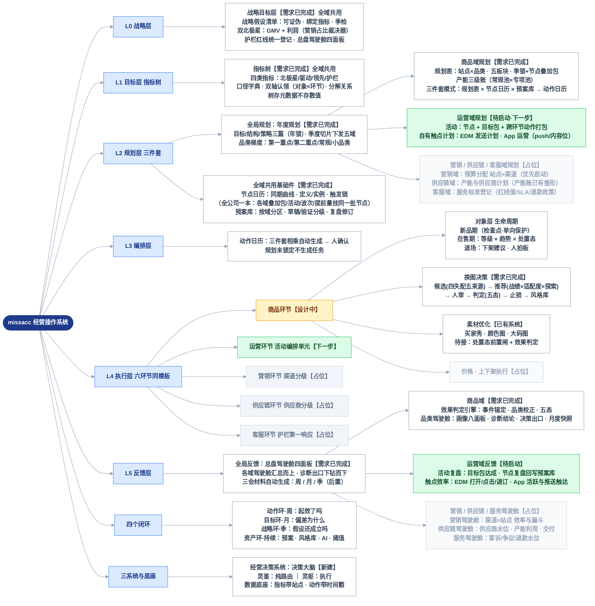

# 经营操作系统 · 结构总览

> 本文档是经营决策系统所有需求文档的目录页与结构地图。
> 总纲一句话：**三个系统、六个层、两个模板、四个环。**

---

# 1. 结构树



# 2. 六层结构速览

| 层 | 内容 | 载体 |
|---|---|---|
| L0 战略 | 战略假设清单（可证伪、季度验证）、北极星（GMV/利润，切换留痕）、护栏红线（客诉率、争议率，触线即升级） | 假设清单 |
| L1 目标 | 指标树：北极星 → 驱动指标 → 领先指标；目标四件套（口径/基线/目标值/Owner），按环节认领 | 指标树 |
| L2 规划 | 全局规划：年度规划三篇（年锁）→ 季度切片下发五域；共用基础件：节点日历（全公司一本）+ 预案库（按域分区）；商品域规划表（季锁）已成稿；运营域规划（活动 + EDM/App 触点）待启动；营销/供应链/客服域占位 | 年度规划 + 共用件 + 各域规划 |
| L3 编排 | 三件套相乘自动生成动作日历初稿，人确认；规划未锁定不生成任务 | 动作日历 |
| L4 执行 | 六环节同模板（目标 → 对象分级 → 动作库 → 日历 → 反馈）；动作按六段管线跑 | 任务流（灵枢） |
| L5 反馈 | 全局反馈：总盘驾驶舱（各域汇总而上、诊断出口下钻而下）；商品域：判定引擎 + 品类驾驶舱；运营域活动复盘待启动；营销/供应链/服务驾驶舱占位；三会材料后置 | 总盘驾驶舱 + 各域驾驶舱 |

**两个模板**：环节接入模板（五问：认领指标 / 对象与分级 / 动作库 / 过程目标 / 节点与预案）；动作管线模板（触发候选 → 优先级 → 建议+人审 → 执行 → 判定 → 止损/沉淀）。

**四个环**：动作环（周）、目标环（月）、战略环（季）、资产环（持续：预案库、风格库、AI 权重、阈值——均被数据校准）。

**三系统分工**：经营决策系统（新建，决策大脑：规则/建议/判定/规划/复盘）、灵鉴（纯路由）、灵枢（执行）。数据底座：对象主数据 + 指标数据（SPU×日，带站点字段）+ 动作留痕（时间戳锚点）。

## 三条轴：流程 × 对象 × 职能

整个系统由三条正交的轴撑起：

- **流程轴（六层 L0–L5）**：决策怎么流动——从假设到规划到执行到反馈。每个域都走同样的六层。
- **对象轴（经营对象树）**：决策作用在谁身上——总盘到 SKU。
- **职能轴（经营域）**：决策由哪个经营域发起——**商品 / 运营 / 营销 / 供应链 / 客服**，五域与 L4 五环节一一对应（规划层到执行层同一套域划分）。商品域以品类为主轴，已全线成稿；其余四域各自有独立的经营对象（活动、渠道、供应商、服务线），后续按同一设计语言补建"域规划 + 域驾驶舱"。

规划与反馈在职能轴上一下一上：**规划自上而下**——全局规划（年度规划）季度切片下发各域，各域数字加总须等于全局（对齐链一的前提）；**反馈自下而上**——各域驾驶舱汇总到总盘驾驶舱，诊断出口再从总盘下钻回各域。

### 职能域一览

| 域 | 主经营对象 | L2 规划载体 | L5 反馈载体 | 状态 |
|---|---|---|---|---|
| 商品 | 品类（→SPU→SKU） | 品类规划表 + 产能三级账（节点日历/预案库为全域共用件） | 品类驾驶舱 | 需求完成 |
| 运营 | 活动（节点 × 目标包）+ 自有触点（EDM / App） | 活动编排单元 + 触点计划（EDM 发送 / App push·内容位） | 活动复盘（回写预案库）+ 触点效率（打开/点击/退订/活跃） | 待启动（下一步） |
| 营销 | 渠道 × 站点 | 预算分配表 | 营销驾驶舱（效率/漏斗） | 占位（占位域中优先） |
| 供应链 | 供应商 × 产能 | 产能与供应商计划 | 供应链驾驶舱 | 产能三级账已有雏形 |
| 客服 | 服务线 × 站点 | 服务标准登记（红线/SLA/政策） | 服务驾驶舱 | 占位 |

注一（运营/营销边界）：**营销域 = 付费获客**（投放渠道，花媒体钱买流量）；**运营域 = 自有流量经营**（站内活动、EDM、App 触点，不花媒体钱）。退订率、push 关闭率是运营域的红线候选（过度触达伤自有流量池）。

注二（运营域性质）：运营域是"横向打包"域——活动要引用其他域的动作（商品上新、营销投放等）组包；节点活动包内含 EDM 波次与 App push 排期，与商品域共用同一本节点日历。写活动编排单元需求时需把跨域引用设计清楚。

**全域共用件**：L0 假设清单、L1 指标树（双轴认领本就按 对象×环节 设计）、年度规划、**节点日历**（全公司一本，各域的叠加包/活动/EDM 波次/产能提前量挂同一批节点，年度目标月度分解用同一条曲线）、**预案库**（库一个、按域分区，草稿/验证分级规矩通用）、总盘驾驶舱——五个域的假设、指标、红线、节奏都登记在同一处，不按域另立。

**三件套是可复制的域规划模式**：域规划表（定什么）× 节点日历（什么时候，共用）× 预案库（出事怎么办，域分区）→ 相乘生成该域动作日历。商品域是第一个实例（品类规划表）；其余域按同一模子建。

**交叉挂点**（域与商品对象轴的接口，已在现有文档中预留）：品类规划表"营销资源"板块 = 营销域预算在品类上的切片；产能专项池 = 供应链域产能在品类事件上的切片；品类驾驶舱"营销效率""服务与交付护栏"面板 = 域数据的摘要行 + 跳转。职能域建成后，这些挂点从孤立面板改为引用域内唯一出处——一个出处、各处引用。

## 经营对象树（对象轴）

每层制品在对象树的某一级实例化：

```
总盘 → 站点 → 大类 → 品类 → SPU → SKU
        │       │       │
        │       │       └ 品类梯度：第一重点/第二重点/常规/小品类（假设驱动 · 年度人定 · 大类内划分）
        │       └ 大类：衣服 / 鞋子+ACC（静态归类）
        └ 站点分级：S 级站点配专属运营/营销（单独规则、单独产能账）
横向对象：风格库 · 供应商（供应链域主对象）· 渠道（营销域主对象）
```

| 层制品 | 挂载层级 |
|---|---|
| L0 双北极星 / 利润目标 / 总盘驾驶舱 | 总盘 |
| 年度规划·结构篇（贡献占比） | 站点、大类 |
| L2 规划表 / 产能账 | 站点 × 大类 × 品类（站点在品类上一层，规划树与责任树同构） |
| L5 品类驾驶舱 | 品类（站点切片视图） |
| L4 动作（换图 / 素材） | SPU |
| 结构三维（价格段/颜色/尺码） | SKU |

分级配资源是全体系通用模式：商品等级、站点等级、品类梯度、供应商分级、渠道分级——同一模式的不同对象实例。

# 3. 需求文档索引

| 文档 | 范围 | 状态 |
|---|---|---|
| [换图决策需求](./换图决策需求.md) | 商品环节·换图动作域：候选、风格推荐、判定、止损、风格库治理、配置管理、AI 方案 | 需求完成 |
| [商品对象层需求](./商品对象层需求.md) | 商品环节·对象层：生命周期、销量等级、趋势标签、处置态、新品管理 | 需求完成 |
| [品类驾驶舱需求](./品类驾驶舱需求.md) | L5 反馈层·品类决策视图：画像八面板（含毛利/集中度/结构三维）、诊断结论、决策区出口、月度快照 | 需求完成 |
| [规划三件套需求](./规划三件套需求.md) | L2 规划层：品类规划表（站点×品类·五板块·季锁+叠加包，商品域实例）、节点日历与预案库（全域共用件，各域引用）、产能三级账、五张表单；三件套模式为各域可复制模板 | 需求完成 |
| [战略目标层需求](./战略目标层需求.md) | L0+L1+L2 顶层：战略假设清单、年度规划三篇（目标/结构/策略·品类梯度）、指标树（口径/责任/分解）、总盘驾驶舱、三条对齐链 | 需求完成 |
| [全局信息架构与通用规范](./全局信息架构与通用规范.md) | 横切：六板块导航与页面收编、角色权限矩阵、四个通用组件（建议卡片/目标现状面板/留痕条/诊断行）、通知三级送达、补充页面（待办中心/SPU 360）、口径修订记录 | 需求完成 |
| 活动编排单元 | 运营域（L2 规划 + L5 复盘）：活动 = 节点 + 目标包 + 跨环节动作打包；含 EDM 发送计划与 App 运营（push/内容位）的触点计划 | 待启动 |
| 三会材料与决议登记 | 周/月/季会材料自动装配、决议跟踪（零件已备：快照、品类分册、诊断结论） | 后置 |
| [买家秀管理需求](./买家秀管理需求.md) | 灵枢执行侧：买家秀生产链路（先行已有） | 已实现 |

# 4. 推进路线（自下而上）

```
✅ 动作域：换图决策
✅ ① 对象层：生命周期 × 等级 × 趋势 × 处置态 × 新品管理
✅ ② 品类驾驶舱：画像八面板 + 诊断结论 + 决策区 + 月度快照
✅ ③ 规划三件套：规划表（站点×品类）+ 节点日历（触发链）+ 预案库 + 产能三级账
✅ ④ 战略目标层：假设清单 + 年度规划（目标/结构/策略）+ 指标树 + 总盘驾驶舱（本次）
→ 运营域：活动编排单元（可在 ② 后并行启动；活动 = 节点 + 目标包 + 跨环节动作打包）
→ 营销 / 供应链 / 客服域：各建"域规划 + 域驾驶舱"（商品域已成稿；营销优先；交叉挂点已预留，商品域文档无需改动）
→ 后置：三会材料装配 + 决议登记（零件已备）
```

原则：每上一层，下层已建的东西成为它的数据来源（处置态喂驾驶舱、驾驶舱喂规划表、规划表喂三会）——顺序不能倒，倒了上层是空架子。自下而上主线至此闭合：L0–L5 六层需求全部成稿。
